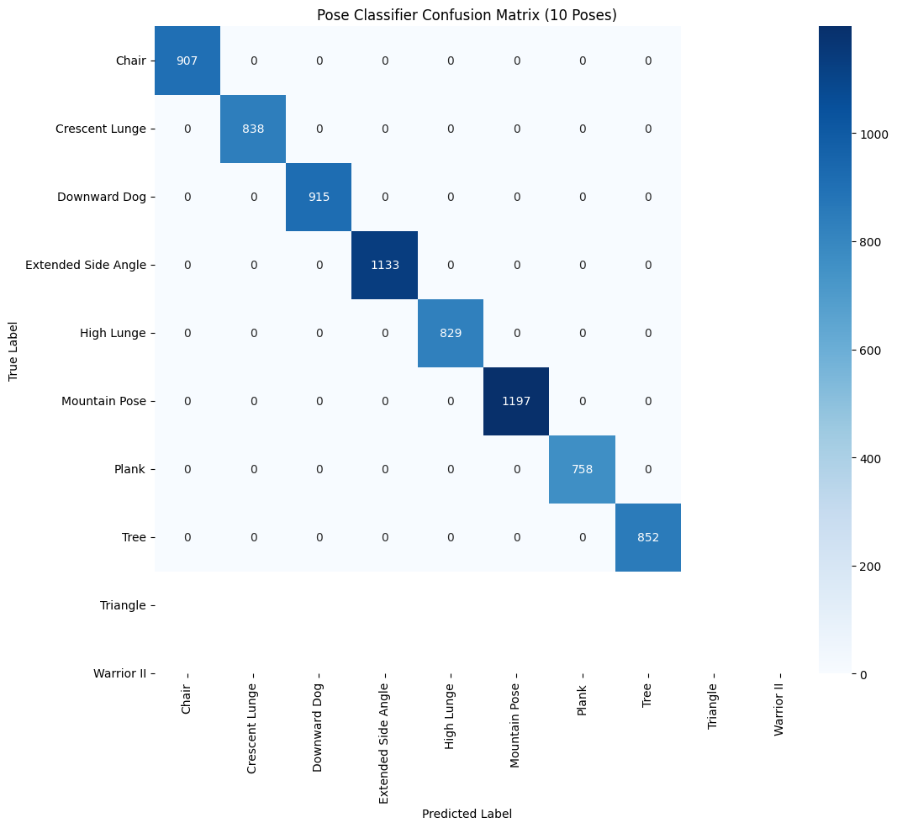

# ZENith: Real-Time AI Movement Coach

**Anthony C. Perry** -- [github.com/aperry938](https://github.com/aperry938)

---

## Abstract

This project investigates real-time biomechanical form assessment through a computer vision pipeline integrating MediaPipe pose estimation, a custom Variational Autoencoder for movement quality scoring, and Random Forest classification across 10 yoga poses. A novel video dataset of 100+ self-recorded sequences bridges kinesiology expertise with supervised learning. The system explores how AI feedback for embodied practice can be designed to support skill acquisition.

---

## Demo

A short video demonstrating the live application can be found here:

[](https://youtu.be/lPnmOBwJfkE)

---

## System Architecture


---

## Core Components

### VAE Quality Scoring
A Variational Autoencoder trained on correctly-executed pose sequences learns a latent distribution of proper form. Reconstruction error against this learned manifold produces a continuous 0--100 quality score, enabling nuanced feedback beyond binary correct/incorrect classification.

### MediaPipe Pose Estimation
Google's MediaPipe extracts 33 three-dimensional skeletal landmarks from each video frame, providing the spatial data that drives all downstream analysis.

### Random Forest Classification
A Random Forest classifier trained on extracted pose features identifies the current pose from 10 supported asanas with high confidence, enabling pose-specific feedback and angle thresholds.

### Joint Angle Analysis
Eight biomechanical joint angles (bilateral shoulders, elbows, hips, knees) are computed in real time from landmark coordinates, providing interpretable kinematic data for both the coaching system and the practitioner.

### Gemini Coaching Module
Google's Gemini API generates context-aware verbal coaching cues based on the identified pose, quality score, and joint angle deviations, translating quantitative assessment into actionable guidance.

---

## Results

The pose classifier achieved **99%+ accuracy** on the held-out test set. The confusion matrix below shows near-perfect classification across all 10 yoga poses.



**Application Screenshots:**

| Correct Warrior II | Correct Crescent Lunge |
| :---: | :---: |
|  |  |

---

## Research Questions

1. **How can biomechanical expertise be computationally encoded for real-time feedback?** The system operationalizes kinesiology knowledge through joint angle thresholds and a VAE-learned quality manifold, testing whether domain expertise transfers effectively into algorithmic form.

2. **What role does AI-generated coaching play in embodied skill acquisition?** By coupling pose detection with natural language coaching via Gemini, the project examines whether AI-mediated feedback can meaningfully support motor learning in unstructured home practice environments.

3. **How should movement quality be modeled beyond binary classification?** The VAE's continuous quality score challenges the pass/fail paradigm common in pose estimation research, exploring whether gradient feedback better reflects the continuous nature of movement proficiency.

---

## Future Directions

- **Body-type adaptation:** Investigating how morphological variation affects pose estimation accuracy and quality scoring, with the goal of personalized biomechanical baselines.
- **Clinical rehabilitation applications:** Extending the pipeline to physical therapy contexts where real-time movement feedback could support recovery protocols.
- **Algorithmic bias in pose assessment:** Examining how training data composition and skeletal model assumptions may systematically disadvantage certain body types, and developing mitigation strategies.

---

## Stack and Requirements

| Component | Technology |
|-----------|------------|
| Pose estimation | MediaPipe |
| Quality scoring | TensorFlow / Keras (VAE) |
| Classification | scikit-learn (Random Forest) |
| Frontend | React 19 / Vite / TypeScript |
| Backend | FastAPI / Uvicorn / WebSocket |
| Coaching | Google Gemini API |
| Language | Python 3.10+ |

### Reproduction

```bash
git clone https://github.com/aperry938/zenith-mvp
cd zenith-mvp
conda create --name zenith python=3.11 -y
conda activate zenith
pip install -r requirements.txt
python server.py
# In a second terminal:
cd zenith-web && npm run dev
```

Model training notebook: [Google Colab](https://colab.research.google.com/drive/1DSYxlitGTFTivI2nsCgHxrPoP5nJK-5Y)

---

## License

This project is licensed under the MIT License. See [LICENSE](LICENSE) for details.
